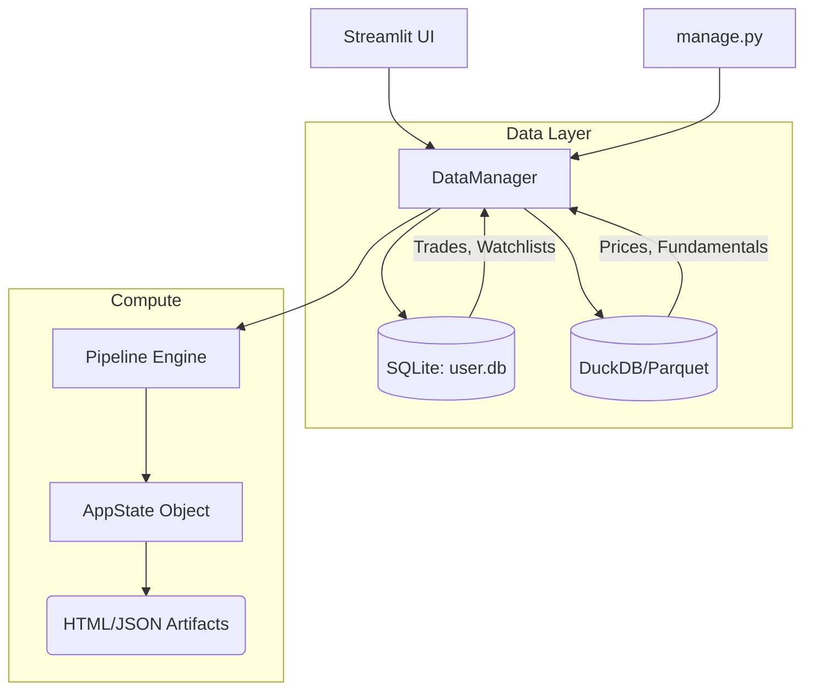

# System Architecture

## Overview
The Personal Investor Assistant uses a **Hybrid Data Architecture** to balance transactional safety with analytical performance.

## Components

### 1. DataManager (`storage/datamanager.py`)
The single source of truth for all data access. It abstracts whether data comes from:
- **Files**: Legacy mode (`transactions.csv`, `watchlist.yml`).
- **Database**: Modern mode (`user.db`).
- **Hybrid**: Reads from DB, falls back to files, writes to both (default during migration).

### 2. User Store (`storage/repo.py` + `storage/models.py`)
Relational data stored in SQLite.
- **Portfolios**: Multi-portfolio support enabled by schema.
- **Trades**: Ledger of all buy/sell actions.
- **Runs**: History of every computation run (RunManifest).

### 3. Market Store (`src/streamlit_data.py` wrapper)
Analytical data stored in Parquet (queried via DuckDB).
- **Prices**: Daily OHLCV.
- **Scores**: Computed factors and ranks.
- **Universe**: Stock metadata.

### 4. Headless Compute (`src/pipeline.py`)
Decoupled logic that can run without the UI (e.g., via Cron).
- Initializes a `Run`.
- Loads data.
- Computes metrics.
- Saves `RunManifest` and Artifacts.
